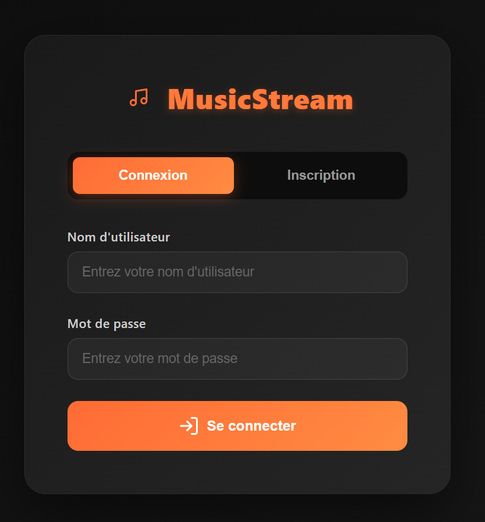
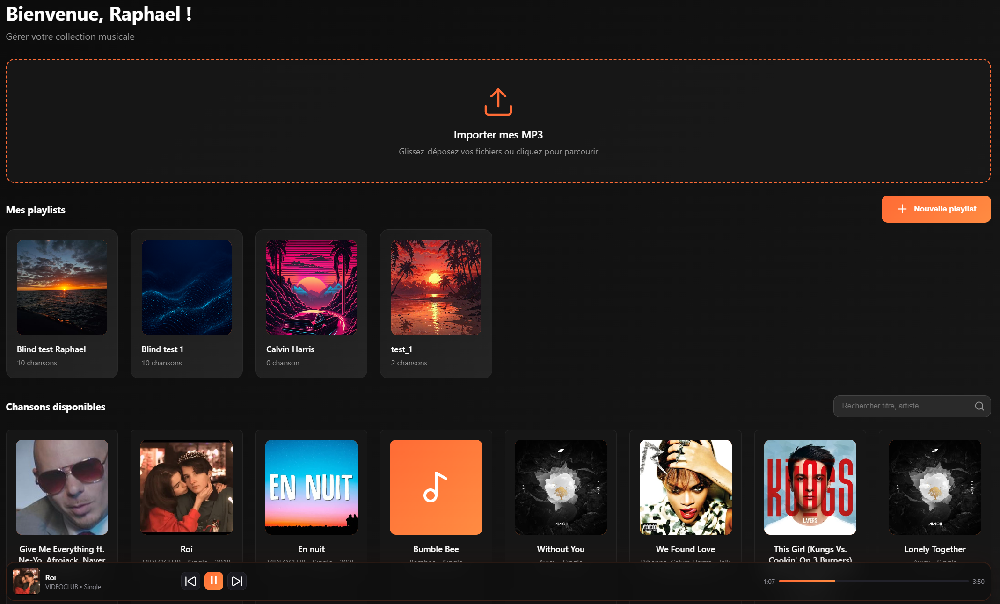
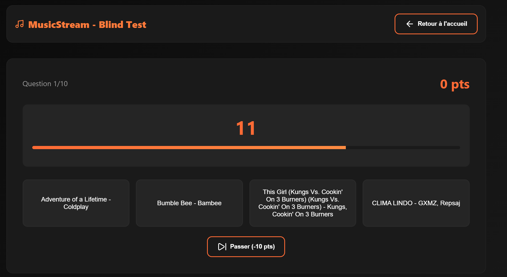
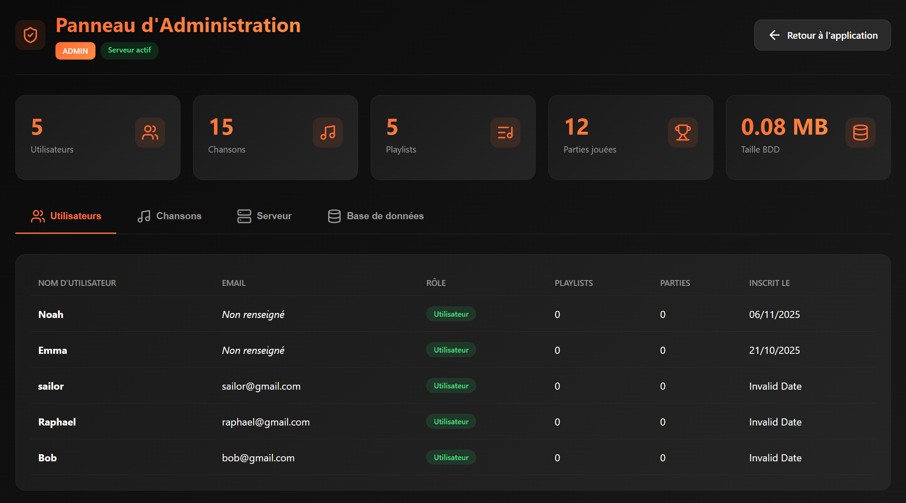

# Plateforme de Streaming Musical
## SAE 3.02

**Groupe :** Groupe02
**Membres :**
- MORISCOT Raphaël    
- LAURET Pierre
- NOURMANOD NAZIR Michael

**Date :** 15/11/2025
**Encadrant :** M.LACHOUMANE
**Formation :** BUT Réseaux & Télécommunications - Semestre 3
**IUT :** IUT de la Réunion

</div>

---

## 1. Introduction

Ce projet a été réalisé dans le cadre de la **SAE 3.02** du BUT Réseaux et Télécommunications, semestre 3.

### 1.1 Contexte

L'objectif principal était de développer une plateforme web complète de streaming musical avec un système de blind test interactif, en mettant l'accent sur :
- La conception d'une architecture client-serveur moderne
- L'intégration de technologies web actuelles
- La gestion de flux audio en temps réel
- La conteneurisation avec Docker pour garantir la portabilité

### 1.2 Problématique

Le projet répond au besoin de créer une application de streaming musical locale et interactive permettant :
- L'écoute de musiques en streaming
- L'organisation de blind tests solo ou multijoueur
- La gestion de bibliothèques musicales personnalisées
- Une administration complète du contenu

Cette plateforme vise à offrir une expérience utilisateur fluide et moderne, accessible depuis n'importe quel navigateur web.

---

## 2. Présentation du projet

### 2.1 Fonctionnalités principales

#### Authentification et profils
- **Inscription/Connexion sécurisée** : Système d'authentification par JWT (JSON Web Tokens) avec hashage des mots de passe via Bcrypt
- **Gestion de profil** : Profil utilisateur personnalisable avec avatar (hébergement via Cloudinary)
- **Rôles utilisateur** : Distinction entre utilisateurs standards et administrateurs

#### Streaming musical
- **Lecture audio** : Player audio intégré avec contrôles de lecture (play/pause, volume, progression)
- **Recherche** : Moteur de recherche de morceaux par titre, artiste ou album
- **Gestion de playlists** : Création, modification et suppression de playlists personnalisées
- **Upload de morceaux** : Import de fichiers audio avec extraction automatique des métadonnées (artiste, album, durée)

#### Blind Test
- **Mode solo** : Entraînement individuel avec système de scoring
- **Mode multijoueur** : Sessions en temps réel avec plusieurs joueurs connectés via WebSocket (Socket.io)
- **Système de points** : Attribution de points selon la rapidité de réponse
- **Statistiques** : Historique des parties et classement des joueurs

#### Administration
- **Tableau de bord** : Vue d'ensemble des statistiques de la plateforme
- **Gestion des utilisateurs** : Liste, modification, suppression de comptes
- **Gestion du contenu** : Administration des morceaux et playlists
- **Statistiques** : Suivi de l'utilisation de la plateforme (nombre d'utilisateurs, morceaux, parties jouées)

### 2.2 Architecture générale

Le projet est basé sur une **architecture client-serveur à trois niveaux** :

```
┌─────────────────────────────────────────────────────┐
│                  Navigateur Web                      │
│              (Frontend - HTML/CSS/JS)                │
└──────────────────┬───────────────────────────────────┘
                   │ HTTP/REST + WebSocket
                   │
┌──────────────────▼───────────────────────────────────┐
│         Serveur Node.js (Backend)                    │
│  - Express.js (API REST)                             │
│  - Socket.io (Temps réel)                            │
│  - JWT + Bcrypt (Authentification)                   │
│  - Multer (Upload fichiers)                          │
└──────────────────┬───────────────────────────────────┘
                   │ Mongoose ODM
                   │
┌──────────────────▼───────────────────────────────────┐
│            MongoDB (Base de données)                 │
│  - Collections: users, songs, playlists,             │
│    blindTestGames, playerStats, blindTestRooms       │
└──────────────────────────────────────────────────────┘

         Stockage externe : Cloudinary
         (Fichiers audio + avatars utilisateurs)
```

**Conteneurisation Docker** :
- Conteneur 1 : Application Node.js (app)
- Conteneur 2 : Base de données MongoDB
- Réseau bridge privé entre les conteneurs
- Volumes persistants pour les données

### 2.3 Technologies utilisées

| Catégorie | Technologies |
|-----------|-------------|
| **Backend** | Node.js 18 LTS, Express.js, Socket.io, Mongoose ODM |
| **Frontend** | HTML5, CSS3, JavaScript ES6+ (vanilla) |
| **Base de données** | MongoDB 7.0 |
| **Authentification** | JWT (jsonwebtoken), Bcrypt |
| **Stockage externe** | Cloudinary (audio + images) |
| **Upload** | Multer |
| **Métadonnées** | music-metadata |
| **Conteneurisation** | Docker, Docker Compose |
| **Environnement** | dotenv |
| **Développement** | nodemon, Git |

**Justification des choix** :
- **Node.js + Express** : Léger, performant, asynchrone, idéal pour le temps réel
- **MongoDB** : Base NoSQL flexible, adaptée aux données musicales (schéma évolutif)
- **Socket.io** : Bibliothèque éprouvée pour le temps réel (blind test multijoueur)
- **Docker** : Portabilité garantie sur Windows, macOS et Linux
- **Cloudinary** : Solution cloud fiable pour l'hébergement de fichiers lourds

### 2.4 Architecture des fichiers

```
Projet/
├── backend/
│   ├── models/              # Modèles Mongoose
│   │   ├── user.js
│   │   ├── song.js
│   │   ├── playlist.js
│   │   ├── blindTestGame.js
│   │   ├── blindTestRoom.js
│   │   └── playerStats.js
│   ├── routes/              # Routes API REST
│   │   ├── auth.js
│   │   ├── songs.js
│   │   ├── playlists.js
│   │   ├── blindtest.js
│   │   ├── profile.js
│   │   └── admin.js
│   ├── middleware/          # Middlewares
│   │   └── auth.js          # Vérification JWT
│   ├── config/
│   │   └── db.js            # Connexion MongoDB
│   └── utils/
│       └── cleanMetadata.js
├── frontend/                # Pages HTML + assets
│   ├── index.html           # Accueil
│   ├── login.html           # Connexion/Inscription
│   ├── blindtest.html       # Blind test
│   ├── admin.html           # Dashboard admin
│   ├── diagnostic.html      # Page de diagnostic
│   ├── css/
│   └── js/
├── Streaming_platform/      # Dump MongoDB (données initiales)
├── docs/                    # Documentation
│   ├── documentation_technique.md
│   ├── api_reference.md
│   ├── README-DOCKER.md
│   └── guide_rendu.md
├── server.js                # Point d'entrée de l'application
├── docker-compose.yml       # Orchestration Docker
├── Dockerfile               # Image Docker de l'app
├── init-mongo.sh            # Script d'initialisation MongoDB
├── package.json
├── .env.docker              # Variables d'environnement Docker
├── .env.example             # Template de configuration
└── README.md

```

---

## 3. Déroulement du projet

### 3.1 Organisation de l'équipe

**Répartition des tâches** :

| Membre | Rôles et responsabilités |
|--------|-------------------------|
| MORISCOT Raphaël | Backend : API REST, modèles Mongoose, authentification JWT |
| NOURMAMOD NAZIR Michael | Frontend : Interface utilisateur, intégration Socket.io, CSS |
| LAURET Pierre | Base de données : Schéma MongoDB, Docker, configuration Cloudinary |

**Coordination** : [Décrire l'organisation : répartition Git, outils de communication, etc.]

### 3.2 Méthodologie

**Organisation du travail** :
- Découpage du projet en sprints fonctionnels (authentification → streaming → blind test → admin)
- Utilisation de Git et GitHub pour le versioning et la collaboration
- Réunions régulières pour synchronisation et résolution des blocages
- Tests progressifs sur Docker pour garantir la portabilité

**Outils de gestion** :
- **Git/GitHub** : Gestion de versions, branches par fonctionnalité
- **Docker Desktop** : Environnement de développement unifié
- [**Autres outils** : Trello, Discord, etc. - À compléter]

### 3.3 Difficultés rencontrées

#### Problème 1 : Compatibilité Docker sous Windows
**Description** : Sur certaines machines Windows, WSL2 n'était pas activé, causant des erreurs au lancement de Docker Desktop.

**Solution** : Installation et configuration de WSL2, activation de la virtualisation dans le BIOS, documentation détaillée dans [README-DOCKER.md](docs/README-DOCKER.md).

#### Problème 2 : Gestion des fichiers audio lourds
**Description** : Hébergement local des fichiers audio trop volumineux (plusieurs Go), ralentissant les commits Git et les déploiements.

**Solution** : Intégration de Cloudinary pour l'hébergement externe des fichiers, réduction drastique de la taille du projet.

#### Problème 3 : Synchronisation temps réel pour le blind test multijoueur
**Description** : Coordination de l'état du jeu entre plusieurs clients (démarrage de la musique, comptage des points, gestion des déconnexions).

**Solution** : Utilisation de Socket.io avec salles (rooms), gestion d'états côté serveur, émission d'événements synchronisés.

#### Problème 4 : Sécurité et authentification
**Description** : Protection des routes sensibles (admin, upload), stockage sécurisé des mots de passe.

**Solution** : Middleware d'authentification JWT, hashage Bcrypt avec salt rounds, vérification des rôles utilisateur.

#### Problème 5 : Extraction des métadonnées audio
**Description** : Récupération automatique du titre, artiste, album depuis les fichiers MP3.

**Solution** : Intégration de la bibliothèque `music-metadata` pour parser les tags ID3.

### 3.4 Solutions apportées

| Problème | Solution technique | Résultat |
|----------|-------------------|----------|
| Portabilité multi-OS | Docker + Docker Compose | Application fonctionnelle sur Windows/macOS/Linux |
| Stockage fichiers lourds | Cloudinary | Réduction du poids du projet, streaming rapide |
| Temps réel multijoueur | Socket.io avec rooms | Synchronisation fluide entre joueurs |
| Sécurité | JWT + Bcrypt + middleware auth | Protection efficace des données et routes |
| Métadonnées audio | music-metadata | Import automatisé des informations |

---

## 4. Résultats

### 4.1 Fonctionnalités réalisées

**Authentification et profils** (100%)
- Inscription avec validation des champs
- Connexion avec génération de token JWT
- Upload et modification d'avatar
- Gestion de profil utilisateur

**Streaming musical** (100%)
- Player audio fonctionnel
- Recherche et filtrage de morceaux
- Création et gestion de playlists
- Upload de morceaux avec extraction automatique des métadonnées

**Blind test** (100%)
- Mode solo avec système de scoring
- Mode multijoueur avec Socket.io
- Système de rooms pour parties privées
- Historique et statistiques des parties

**Administration** (80%)
- Dashboard avec statistiques globales
- Gestion CRUD des utilisateurs
- Gestion CRUD des morceaux et playlists
- Logs et monitoring

**Infrastructure** (100%)
- Conteneurisation Docker complète
- Import automatique des données MongoDB
- Documentation technique exhaustive
- Tests de portabilité réussis sur Windows, macOS, Linux

### 4.2 Fonctionnalités non réalisées

**Système de recommandations musicales** (0%)
- **Raison** : Complexité algorithmique élevée, temps insuffisant
- **Impact** : Faible, fonctionnalité bonus

**Export de playlists** (0%)
- **Raison** : Priorité donnée au blind test multijoueur
- **Impact** : Moyen, fonctionnalité de confort

**Mode hors ligne (PWA)** (0%)
- **Raison** : Nécessite service workers, complexité additionnelle
- **Impact** : Faible, application destinée à un usage local/intranet

### 4.3 Captures d'écran

#### Page de connexion

*Interface d'authentification avec formulaire d'inscription et de connexion*

#### Interface principale de streaming

*Player audio, liste de morceaux et playlists*

#### Blind test multijoueur

*Interface de jeu avec timer et zone de réponse*

#### Dashboard administrateur

*Statistiques globales et gestion des contenus*


> **Note** : Les captures d'écran sont disponibles dans le dossier `docs/screenshots/`.

---

## 5. Bilan et perspectives

### 5.1 Points forts

**Technique**
- Application fonctionnelle et stable, testée sur plusieurs environnements
- Conteneurisation Docker réussie, garantissant une portabilité parfaite
- Architecture modulaire et maintenable (séparation frontend/backend, modèles MVC)
- Sécurité correctement implémentée (JWT, Bcrypt, protection des routes)
- Temps réel fonctionnel avec Socket.io pour le blind test multijoueur

**Organisation**
- Bonne répartition des tâches et collaboration efficace
- Documentation exhaustive (technique, API, Docker, rendu)
- Versioning Git structuré avec historique clair
- Tests réguliers pendant le développement

**Pédagogique**
- Maîtrise approfondie de Node.js et Express
- Compréhension de Docker et de l'orchestration de conteneurs
- Pratique du développement full-stack (frontend + backend + BDD)
- Gestion d'API REST et WebSocket

### 5.2 Points faibles

**Technique**
- Frontend en JavaScript vanilla (pas de framework moderne comme React/Vue)
- Gestion limitée des erreurs réseau côté client
- Absence de tests automatisés (unitaires, intégration)
- Interface utilisateur basique (design améliorable)

**Organisation**
- Quelques difficultés de coordination au début du projet
- Courbe d'apprentissage Docker plus longue que prévu
- Temps de développement sous-estimé pour certaines fonctionnalités

**Fonctionnalités**
- Système de recommandations non implémenté
- Absence de mode hors ligne
- Personnalisation limitée de l'interface utilisateur

### 5.3 Améliorations possibles

**Court terme**
- Améliorer le design de l'interface (framework CSS moderne : Tailwind, Bootstrap)
- Ajouter des tests unitaires et d'intégration (Jest, Mocha)
- Implémenter la gestion d'erreurs réseau côté client
- Ajouter un système de notifications en temps réel

**Moyen terme**
- Migrer le frontend vers un framework moderne (React, Vue.js)
- Implémenter un système de recommandations basé sur l'historique d'écoute
- Ajouter un chat en temps réel pendant les blind tests
- Créer une API publique documentée (Swagger/OpenAPI)

**Long terme**
- Déploiement en production (Heroku, AWS, DigitalOcean)
- Mise en place de CI/CD (GitHub Actions, GitLab CI)
- Support multi-langues (i18n)
- Application mobile native (React Native)
- Intégration avec des API musicales externes (Spotify, Deezer)

### 5.4 Compétences acquises

**Compétences techniques**
- Développement full-stack avec Node.js et MongoDB
- Conteneurisation et orchestration avec Docker
- Gestion de l'authentification et de la sécurité web
- Communication temps réel avec WebSocket (Socket.io)
- Manipulation de fichiers et métadonnées audio
- Requêtes HTTP et conception d'API REST

**Compétences transversales**
- Travail en équipe et répartition des tâches
- Gestion de projet et méthodologie agile
- Documentation technique et utilisateur
- Résolution de problèmes et débogage
- Veille technologique et apprentissage autonome

---

## 6. Conclusion

Ce projet SAE 3.02 nous a permis de développer une **plateforme de streaming musical complète et fonctionnelle**, intégrant des fonctionnalités avancées telles que l'authentification sécurisée, le streaming audio, et un système de blind test multijoueur en temps réel.

**Apports pédagogiques majeurs** :
- Maîtrise approfondie de l'écosystème Node.js et de l'architecture client-serveur moderne
- Compréhension des enjeux de conteneurisation et de portabilité applicative avec Docker
- Pratique concrète du développement full-stack et de la collaboration en équipe
- Sensibilisation aux problématiques de sécurité web et de gestion de fichiers lourds

L'utilisation de **Docker** a été un choix déterminant, garantissant une portabilité parfaite sur tous les systèmes d'exploitation et simplifiant grandement la phase de test et de démonstration.

Ce projet représente une **expérience complète de développement web**, de la conception initiale au déploiement, en passant par les phases de développement, tests, documentation et livraison. Il constitue une base solide pour de futurs projets full-stack et nous a donné les clés pour aborder des applications web modernes et scalables.

**Liens utiles** :
- Dépôt GitHub : [https://github.com/Raphael-Moris/music_stream](https://github.com/Raphael-Moris/music_stream)
- Documentation technique : [docs/documentation_technique.md](docs/documentation_technique.md)
- Guide Docker : [docs/README-DOCKER.md](docs/README-DOCKER.md)
- API Reference : [docs/api_reference.md](docs/api_reference.md)

---

## 7. Annexes

### Annexe A : Schéma de la base de données

#### Collection `users`
```javascript
{
  _id: ObjectId,
  username: String,           // Unique
  email: String,              // Unique
  password: String,           // Hash Bcrypt
  role: String,               // "user" | "admin"
  avatarUrl: String,          // URL Cloudinary
  createdAt: Date
}
```

#### Collection `songs`
```javascript
{
  _id: ObjectId,
  title: String,
  artist: String,
  album: String,
  duration: Number,           // Secondes
  url: String,                // URL Cloudinary
  coverUrl: String,           // Pochette
  uploadedBy: ObjectId,       // Référence user
  uploadDate: Date
}
```

#### Collection `playlists`
```javascript
{
  _id: ObjectId,
  name: String,
  description: String,
  songs: [ObjectId],          // Références songs
  userId: ObjectId,           // Référence user
  createdAt: Date,
  updatedAt: Date
}
```

#### Collection `blindTestGames`
```javascript
{
  _id: ObjectId,
  userId: ObjectId,
  mode: String,               // "solo" | "multiplayer"
  score: Number,
  correctAnswers: Number,
  totalQuestions: Number,
  duration: Number,           // Secondes
  playedAt: Date
}
```

#### Collection `blindTestRooms`
```javascript
{
  _id: ObjectId,
  roomId: String,             // Unique
  hostId: ObjectId,
  players: [ObjectId],
  status: String,             // "waiting" | "playing" | "finished"
  currentSong: ObjectId,
  scores: Map,                // userId -> score
  createdAt: Date
}
```

#### Collection `playerStats`
```javascript
{
  _id: ObjectId,
  userId: ObjectId,
  totalGames: Number,
  totalScore: Number,
  averageScore: Number,
  bestScore: Number,
  correctAnswers: Number,
  totalAnswers: Number,
  updatedAt: Date
}
```

### Annexe B : Endpoints API principaux

**Authentification**
- `POST /api/auth/register` - Inscription
- `POST /api/auth/login` - Connexion
- `GET /api/auth/me` - Profil utilisateur (JWT)

**Morceaux**
- `GET /api/songs` - Liste des morceaux
- `POST /api/songs` - Upload d'un morceau (auth)
- `GET /api/songs/:id` - Détails d'un morceau
- `DELETE /api/songs/:id` - Suppression (auth)

**Playlists**
- `GET /api/playlists` - Playlists de l'utilisateur (auth)
- `POST /api/playlists` - Création de playlist (auth)
- `PUT /api/playlists/:id` - Modification (auth)
- `DELETE /api/playlists/:id` - Suppression (auth)

**Blind test**
- `GET /api/blindtest/song` - Morceau aléatoire pour blind test
- `POST /api/blindtest/verify` - Vérification de réponse
- `GET /api/blindtest/stats` - Statistiques du joueur (auth)

**Administration**
- `GET /api/admin/stats` - Statistiques globales (admin)
- `GET /api/admin/users` - Liste des utilisateurs (admin)
- `DELETE /api/admin/users/:id` - Suppression utilisateur (admin)

**Profil**
- `GET /api/profile` - Profil utilisateur (auth)
- `PUT /api/profile` - Modification profil (auth)
- `POST /api/profile/avatar` - Upload avatar (auth)

Voir la documentation complète : [docs/api_reference.md](docs/api_reference.md)

### Annexe C : Événements Socket.io

**Client → Serveur**
- `create-room` - Création d'une room
- `join-room` - Rejoindre une room
- `start-game` - Démarrer la partie
- `submit-answer` - Soumettre une réponse
- `leave-room` - Quitter la room

**Serveur → Client**
- `room-created` - Confirmation de création
- `player-joined` - Nouveau joueur rejoint
- `game-started` - Partie démarrée
- `new-question` - Nouvelle question
- `answer-result` - Résultat de réponse
- `game-ended` - Partie terminée
- `error` - Erreur

### Annexe D : Commandes Docker essentielles

```bash
# Démarrage initial
docker compose up --build

# Démarrage en arrière-plan
docker compose up -d

# Arrêt des conteneurs
docker compose down

# Reset complet (avec suppression des données)
docker compose down -v

# Voir les logs
docker compose logs -f

# Voir l'état des conteneurs
docker compose ps

# Accéder au shell du conteneur
docker compose exec app sh

# Accéder à MongoDB Shell
docker compose exec mongodb mongosh Streaming_platform
```

### Annexe E : Variables d'environnement

```env
# Port de l'application
PORT=3500

# Connexion MongoDB
MONGODB_URI=mongodb://mongodb:27017/Streaming_platform

# Secret JWT
JWT_SECRET=votre_secret_securise_32_caracteres

# Cloudinary (stockage externe)
CLOUDINARY_CLOUD_NAME=votre_cloud_name
CLOUDINARY_API_KEY=votre_api_key
CLOUDINARY_API_SECRET=votre_api_secret

# Environnement
NODE_ENV=production
```

---

**© SAE 3.02 – IUT Réseaux & Télécommunications – Promotion 2025**
